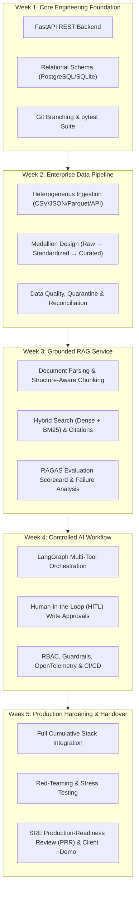

# FDE Fresher Readiness Program | 5-Week Technical Learning Plan

> **Program:** KPMG Forward-Deployed Engineer (FDE) Fresher Readiness Program  
> **Duration:** 5 Weeks Intensive Technical Curriculum  
> **Focus:** Full-Stack AI Engineering, Modular Backend Systems, Enterprise Data Pipelines, Grounded RAG, Controlled Multi-Tool Workflows, Production Hardening & Client Delivery  
> **Companion Documents:**
> - Interactive Checklist: [FDE_Project_Checkpoints_Sep25.md]
> - Integrated Study Plan: [My_FDE_Learning_Plan_Sep25.md]

---

## 🗺️ Curriculum Architecture & Progression

---

## 📊 Executive Summary: 5-Week Curriculum Matrix

| Week # | Focus Area | Technical Learning Objective | Hands-on Mini Project | Key Deliverable |
| :---: | :--- | :--- | :--- | :--- |
| **1** | **Backend & Contracts** | Engineer a modular, testable Python backend with a relational data layer and REST interfaces, using standard source-control and development practices. | **Case-Management Backend:** FastAPI service with PostgreSQL/SQLite, validation, error contracts, structured logs, and automated tests. | Source-controlled FastAPI service, OpenAPI spec, unit/API test suite, and technical README. |
| **2** | **Data Engineering** | Build a repeatable enterprise data pipeline that ingests heterogeneous sources, enforces schemas, applies transformations and data-quality controls, and exposes curated data for downstream services. | **Enterprise Data Pipeline:** Ingest multi-format files and mock REST API, enforce schemas, quarantine invalid records, and reconcile counts. | Medallion storage layers, transformation engine, data quality & reconciliation report, and Dockerfile. |
| **3** | **Grounded RAG** | Design, implement and evaluate a grounded RAG service using document ingestion, embedding-based retrieval, controlled context assembly and measurable quality tests. | **Policy-Knowledge Assistant:** Ingest policy documents, hybrid search index, strict refusal guardrails, source citations, and evaluation scorecard. | End-to-end RAG service, vector index, gold evaluation dataset, RAGAS quality scorecard, and failure log. |
| **4** | **Controlled Agents** | Convert the RAG service into a controlled AI workflow with typed tool integrations, human approval, security guardrails, observability, automated delivery and sandbox deployment. | **Controlled Multi-Tool Workflow:** Stateful workflow with case lookup, ticketing write tool, human approval gate, RBAC, and telemetry. | Typed tool adapters, stateful LangGraph workflow, guardrail configuration, CI/CD pipeline, and sandbox deployment. |
| **5** | **Production Delivery** | Integrate, harden and demonstrate a deployable FDE solution by handling new requirements, technical failures, security tests and production handover artefacts. | **Simulated Client Engagement:** Cumulative solution deployment, handling scope change, resolving seeded incidents, red-team remediation, and live demo. | Tagged release candidate, C4 architecture diagrams, red-team closure report, PRR checklist, and demo pack. |

---

## 🗓️ Detailed Week-by-Week Technical Curriculum

---

### 🛠️ Week 1: Modular Python Backend, Relational Data Layer & REST Interfaces

> **🎯 Technical Learning Objective:**  
> Engineer a modular, testable Python backend with a relational data layer and REST interfaces, using standard source-control and development practices.

#### 🏗️ Hands-on Mini Project
**Build a Case-Management Backend using FastAPI and PostgreSQL/SQLite.**  
The service must:
- Create, retrieve, and update cases
- Validate client requests with strict schemas
- Persist relational records atomically with transactional rollback
- Return consistent error contracts across all endpoints
- Generate structured logs with latency and request metadata
- Include an automated pytest suite and auto-generated OpenAPI documentation

#### 📋 Directional Technical Topics to be Covered
- **FDE Solution Anatomy:** UI, API, data, AI, and integration layers in enterprise architectures.
- **Git & Version Control:** Branching models, conventional commits, pull requests, merge conflict handling, and standard repository layouts (`app/`, `tests/`, `config/`).
- **Python Engineering:** Modules, classes, typing/type hints, environment configuration, custom exception hierarchies, and structured logging.
- **Testing Hygiene:** `pytest` framework, unit tests, fixtures, mocks, patch decorators, and test coverage metrics (>80%).
- **SQL & Relational Modeling:** Normalized schema design (3NF), primary/foreign keys, joins, Common Table Expressions (CTEs), window functions, and ACID transaction isolation.
- **REST APIs & Contracts:** HTTP semantics/status codes, request/response validation (Pydantic), OpenAPI/Swagger specifications, and standardized error envelopes.
- **Engineering Documentation:** Professional `README.md`, reproducible virtual environment setup, database migration runbooks, and API specifications.

#### 💡 Expected Practical Outcomes
- [x] Create and manage a structured Git repository using a clean feature-branch workflow.
- [x] Develop modular Python code organized into clean architectural layers outside notebook-only execution.
- [x] Design and query a normalized relational schema with indexes and foreign key constraints.
- [x] Build and test REST endpoints with validated input/output contracts.
- [x] Diagnose runtime failures and edge cases using structured logs and test evidence.
- [x] Run the complete service locally from scratch following documented setup instructions.

#### 📦 Technical Deliverables
- Source-controlled Python project with standard folder structure
- Database schema definitions and SQL initialization/migration scripts
- FastAPI service with interactive Swagger UI and exported OpenAPI specification
- Automated unit and API integration tests (`pytest`) with coverage reporting
- Configuration template (`.env.example`), structured JSON logging middleware, and exception handlers
- Technical `README.md` with step-by-step setup, database migration, and run instructions

---

### 🛠️ Week 2: Repeatable Enterprise Data Pipeline & Data Quality Controls

> **🎯 Technical Learning Objective:**  
> Build a repeatable enterprise data pipeline that ingests heterogeneous sources, enforces schemas, applies transformations and data-quality controls, and exposes curated data for downstream services.

#### 🏗️ Hands-on Mini Project
**Extend the Week 1 Solution with an Enterprise Ingestion & Transformation Pipeline.**  
The pipeline must:
- Ingest case records, reference data, and policy metadata from files and a mock REST API
- Standardize and join data across disparate formats
- Quarantine invalid records in an isolated dead-letter table
- Reconcile source-to-target record counts (`source == curated + quarantined`)
- Publish curated tables following Medallion architecture principles
- Package and execute the pipeline through a single containerized command

#### 📋 Directional Technical Topics to be Covered
- **Source Ingestion:** Ingesting heterogeneous inputs: CSV, JSON, Parquet, relational database tables, and external REST APIs.
- **Data Profiling:** Completeness (null checks), uniqueness (primary key integrity), validity (regex/type constraints), statistical distribution (outliers/IQR), and referential integrity.
- **Data Transformation (Pandas & PySpark):** Vectorized filtering, joins, aggregations, windowing, deduplication, type casting, and null handling.
- **Schema Contracts & Validation:** Schema definition, strict validation rules, handling schema evolution, and enforcing explicit data contracts.
- **Layered Storage Architecture:** Medallion design patterns—raw (bronze), standardized/cleansed (silver), and curated/aggregated (gold) outputs.
- **Data Quality & Reconciliation:** Automated assertion rules, quarantine/dead-letter table routing, and source-to-target audit count reconciliation.
- **Pipeline Operations:** Incremental loads, idempotent processing keys, and execution run manifests with batch audit metadata.
- **Containerization:** Multi-stage `Dockerfile`, environment variable injection, volume mapping, and repeatable CLI execution.

#### 💡 Expected Practical Outcomes
- [x] Profile unfamiliar enterprise datasets and identify structural, integrity, and quality issues.
- [x] Implement schema-driven ingestion pipelines handling both batch files and REST API endpoints.
- [x] Develop modular, reusable transformations using Pandas and PySpark DataFrames.
- [x] Apply automated data-quality checks, reconciliation count balance, and dead-letter exception routing.
- [x] Preserve execution run manifests and batch audit metadata for full data lineage and idempotent reruns.
- [x] Package the complete pipeline inside Docker for reliable execution across environments.

#### 📦 Technical Deliverables
- File and REST API ingestion adapter components
- Declared source and target schemas / data contract definitions
- Structured Medallion storage tiers: raw, standardized, and curated datasets/tables
- Transformation pipeline built with reusable, testable transformation functions
- Data-quality validation results, quarantined rejected-record output, and reconciliation report
- Run manifest / audit log capturing execution timestamps, batch IDs, and processing statistics
- `Dockerfile` and environment configuration for containerized CLI execution

---

### 🛠️ Week 3: Grounded RAG Service, Retrieval Optimization & Quality Scorecard

> **🎯 Technical Learning Objective:**  
> Design, implement and evaluate a grounded RAG service using document ingestion, embedding-based retrieval, controlled context assembly and measurable quality tests.

#### 🏗️ Hands-on Mini Project
**Add a Policy-Knowledge Assistant to the Case-Management Solution.**  
The service must:
- Ingest approved enterprise policy documents (PDF / Markdown)
- Create a searchable vector index with rich metadata tags
- Answer case-related questions with grounded evidence and exact clause source citations
- Enforce strict refusal behavior when evidence is absent or insufficient
- Apply metadata filters (e.g., policy type, effective date) during search
- Compare at least two retrieval configurations (e.g., Dense Vector vs. Hybrid BM25 + Vector) using a gold evaluation dataset and quality scorecard

#### 📋 Directional Technical Topics to be Covered
- **LLM Application Patterns:** Deterministic logic vs. generative prompting, retrieval augmentation, and structured tool invocation.
- **Prompt Engineering & Boundaries:** System instruction design, strict grounding prompts, structured JSON output enforcement, and refusal boundaries.
- **Document Processing:** PDF/Markdown text parsing, cleaning, layout analysis, and document metadata extraction.
- **Chunking Strategies:** Fixed-size chunking, recursive character chunking, and structure-aware chunking (preserving headers, sections, and clauses).
- **Embeddings & Vector Databases:** Dense embedding generation, vector distance metrics (cosine, inner product), indexing algorithms (HNSW), and similarity search.
- **Retrieval Optimization:** Keyword search (BM25), dense vector retrieval, hybrid search with Reciprocal Rank Fusion (RRF), metadata pre-filtering, and re-ranking.
- **RAG Orchestration:** Query reformulation, multi-source retrieval, context assembly/windowing, answer synthesis, and provenance citation.
- **Quantitative RAG Evaluation:** Curating gold QA evaluation sets; evaluating context precision, context recall, faithfulness, answer relevance, latency, and token cost.
- **Failure Taxonomy & Diagnostics:** Identifying and classifying errors across Ingestion, Chunking, Retrieval, Context Assembly, and Generation stages.

#### 💡 Expected Practical Outcomes
- [x] Build an end-to-end document-to-answer grounded RAG pipeline integrated into the backend.
- [x] Select and tune chunking strategies, retrieval algorithms, and reranking parameters based on quantitative evidence.
- [x] Synthesize responses with traceable source citations while maintaining deterministic refusal for unsupported questions.
- [x] Construct a representative gold evaluation dataset and run repeatable automated evaluation benchmarks.
- [x] Evaluate retrieval and answer quality using quantitative metrics (RAGAS/TruLens) rather than anecdotal spot checks.
- [x] Classify RAG failure modes across the pipeline and implement targeted architectural improvements.

#### 📦 Technical Deliverables
- Document ingestion, parsing, and preprocessing pipeline
- Chunked document corpus with metadata tags and populated vector database index
- RAG API endpoint integrated directly into the Week 1 FastAPI backend
- Versioned system prompt templates and Pydantic structured response schemas
- Gold evaluation dataset with ground-truth context passages and reference answers
- Retrieval and generation quality scorecard comparing baseline vs. optimized configurations
- RAG failure log documenting root causes, implemented fixes, and known residual limitations

---

### 🛠️ Week 4: Controlled AI Workflow, Multi-Tool Integration, Guardrails & Delivery

> **🎯 Technical Learning Objective:**  
> Convert the RAG service into a controlled AI workflow with typed tool integrations, human approval, security guardrails, observability, automated delivery and sandbox deployment.

#### 🏗️ Hands-on Mini Project
**Add Controlled Multi-Tool Workflows with Human-in-the-Loop Verification.**  
The system must:
- Integrate two typed tools: `get_case` (read tool) and `update_ticket` (write tool)
- Enforce strict JSON schema validation, error handling, and idempotent execution
- Implement a stateful workflow orchestration graph with conditional branching and retries
- Require mandatory interactive human approval before executing any ticket status write
- Block unauthorized actions, prompt injection, and unauthorized data leakage
- Instrument the complete execution with OpenTelemetry tracing and correlation IDs
- Deploy the containerized application to an approved sandbox through an automated CI/CD pipeline

#### 📋 Directional Technical Topics to be Covered
- **Tool & Function Calling:** Typed JSON schemas, Pydantic tool models, deterministic error contracts, and idempotency guarantees.
- **Workflow State Machines:** Stateful graph orchestration (LangGraph), conditional edge routing, state persistence, exponential backoff retries, and fallback branches.
- **Human-in-the-Loop (HITL):** Breakpoints, pause/resume workflow state, human inspection interfaces, and approval/rejection gates for consequential actions.
- **Identity & Access Control:** OAuth 2.1 / JWT authentication, Role-Based Access Control (RBAC), and access-aware retrieval filtering (user role $\rightarrow$ document permission).
- **Security & Guardrails:** Secrets management (`.env`/vaults), prompt-injection mitigation, unsafe input sanitization, PII redaction, and policy enforcement.
- **End-to-End Observability:** Distributed correlation IDs (`x-correlation-id`), structured logging, OpenTelemetry traces, latency tracking, token usage, and error metrics.
- **CI/CD Automation:** GitHub Actions / GitLab CI pipelines: automated linting (`ruff`), unit/contract tests (`pytest`), container builds (`docker build`), and release gating.
- **Deployment & Site Reliability:** Container deployment, `/health` and `/ready` probes, zero-downtime rolling updates, automated rollback procedures, and operational runbooks.

#### 💡 Expected Practical Outcomes
- [x] Implement deterministic tool contracts with strict input validation and output serialization.
- [x] Manage stateful multi-step agentic workflows that recover gracefully from tool timeouts and LLM failures.
- [x] Enforce mandatory human approval and role authorization before executing sensitive write operations.
- [x] Capture end-to-end distributed traces and structured audit logs from user input to final action.
- [x] Monitor system latency, functional error rates, and token consumption metrics.
- [x] Automatically build, test, and promote containerized artifacts to a sandbox environment with rollback capabilities.
- [x] Diagnose operational and AI quality incidents from structured telemetry and distributed spans.

#### 📦 Technical Deliverables
- Typed tool schemas, integration adapters, and automated contract test suite
- Stateful workflow orchestration graph with approval gates, retries, and fallback branches
- Access-control configuration (RBAC) and security guardrail middleware
- Structured audit log, distributed OpenTelemetry trace pipeline, and operational metric dashboard
- Automated CI/CD pipeline definition (`.github/workflows/ci.yml`) with quality gates
- Containerized sandbox deployment verified with automated health and readiness probes
- Release checklist, automated rollback runbook, and production support documentation

---

### 🛠️ Week 5: Simulated Client Engagement, Hardening, Red-Teaming & Demonstration

> **🎯 Technical Learning Objective:**  
> Integrate, harden and demonstrate a deployable FDE solution by handling new requirements, technical failures, security tests and production handover artefacts.

#### 🏗️ Hands-on Mini Project
**Complete a Simulated Client Engagement using the Cumulative FDE Solution.**  
The engineer must:
- Analyze a realistic client process brief and update architecture diagrams and technical backlog
- Incorporate a mid-stream controlled scope change into the vertical slices
- Resolve seeded cross-layer system failures (data anomalies, broken API contracts, RAG degradation)
- Conduct adversarial red-teaming (prompt injection, role bypass, malformed data, unsafe tool calls) and close critical findings
- Deploy a hardened Release Candidate (`v1.0.0-rc1`) to an environment
- Deliver a live technical demonstration, stakeholder walkthrough, and production handover pack

#### 📋 Directional Technical Topics to be Covered
- **Technical Discovery & Scoping:** Current-state flow analysis, external system boundaries, interface mapping, technical constraints, and measurable Non-Functional Requirements (NFRs).
- **Architecture Modeling (C4 Model):** System Context, Container, Component, and Data-Flow & Lineage views.
- **Agile Backlog Engineering:** Decomposing client requirements into vertical user stories with strict, testable Technical Acceptance Criteria (TAC).
- **Full-Spectrum Testing:** Automated end-to-end (E2E) journeys, cross-service integration testing, regression test suites, and negative-path validation.
- **Adversarial Red-Teaming:** Prompt injection attacks, role authorization bypass, data pipeline corruption payloads, and unsafe tool execution attempts.
- **Reliability & Performance Engineering:** Stress testing, concurrency load testing (Locust / Locust-like scripts), P95 latency benchmarking, and failure recovery.
- **Technical Governance:** Scope-change impact assessments, trade-off evaluations, and Technical Decision Records (TDRs).
- **Production-Readiness Review (PRR):** Security posture, telemetry completeness, disaster recovery procedures, and known system limitations.
- **Handover & Demonstration:** Technical storytelling, live system walkthrough, knowledge transfer sessions, and client operational handoff.

#### 💡 Expected Practical Outcomes
- [x] Translate discovery inputs and unstructured business requirements into system architecture and testable acceptance criteria.
- [x] Integrate backend, data pipeline, RAG engine, and controlled multi-tool workflows into a unified release candidate.
- [x] Troubleshoot and resolve cross-layer system failures autonomously using logs, traces, and metrics.
- [x] Assess, communicate, and implement mid-engagement scope changes with minimal technical debt.
- [x] Provide empirical evidence of system resilience through red-teaming closure reports, regression suites, and load benchmarks.
- [x] Articulate architectural decisions, trade-offs, and risk mitigations effectively to both technical and executive stakeholders.
- [x] Conduct a complete operational handover enabling client engineering teams to maintain and extend the platform.

#### 📦 Technical Deliverables
- Integrated, version-tagged Release Candidate repository (`v1.0.0-rc1`)
- Complete C4 architecture diagrams (Context, Container, Component, and Data-Flow views)
- Technical backlog with user stories, acceptance criteria, and Technical Decision Records (TDRs)
- Comprehensive test evidence: end-to-end, negative-path, regression, and performance load test reports
- RAG evaluation scorecard and resolved failure log
- Threat and abuse-case assessment with formal Red-Team Closure Report
- Production deployment guide, operations support runbook, and Known-Limitations Register
- Live technical demonstration pack, presentation slide deck, and knowledge-transfer checklist

---

## 📑 Comprehensive Master Reference Table

| Week # | Technical Learning Objective | Directional Technical Topics to be Covered | Hands-on Mini Project | Expected Practical Outcomes after Week | Technical Deliverables |
| :---: | :--- | :--- | :--- | :--- | :--- |
| **1** | Engineer a modular, testable Python backend with a relational data layer and REST interfaces, using standard source-control and development practices. | • FDE solution anatomy: UI, API, data, AI and integration layers • Git: branching, commits, pull requests, merge handling and repository structure • Python: modules, classes, type hints, configuration, exception handling and structured logging • Testing: pytest, unit tests, fixtures, mocks and coverage basics • SQL: schema design, joins, CTEs, window functions and transactions • REST APIs: HTTP methods, request validation, status codes, OpenAPI and error contracts • Engineering documentation: README, setup instructions and API specification | Build a case-management backend using FastAPI and PostgreSQL/SQLite. The service must create, retrieve and update cases; validate requests; persist records; return consistent errors; generate structured logs; and include automated tests and API documentation. | • Create and manage a structured Git repository using a feature-branch workflow • Develop modular Python code outside notebook-only execution • Design and query a normalized relational schema • Build and test REST endpoints with validated input/output contracts • Diagnose failures using logs and test evidence • Run the complete service locally from documented setup steps | • Source-controlled Python project with standard folder structure • Database schema and SQL scripts • FastAPI service with generated OpenAPI specification • Automated unit and API tests • Configuration template, structured logs and exception handling • Technical README with setup and run instructions |
| **2** | Build a repeatable enterprise data pipeline that ingests heterogeneous sources, enforces schemas, applies transformations and data-quality controls, and exposes curated data for downstream services. | • Source ingestion: CSV, JSON, Parquet, relational tables and REST APIs • Data profiling: completeness, uniqueness, validity, distribution and referential integrity • Pandas and PySpark DataFrame operations: filter, join, aggregate, window, deduplicate and null handling • Schema definition, validation, evolution and data contracts • Layered data design: raw, standardized and curated outputs • Data-quality rules, rejected-record handling and reconciliation controls • Incremental loads, idempotent processing and audit metadata • Containerization: Dockerfile, environment configuration and repeatable execution | Extend the Week 1 solution with a pipeline that ingests case records, reference data and policy metadata from files and a mock REST API. Standardize and join the data, quarantine invalid records, reconcile source-to-target counts, publish curated tables and run the pipeline through a containerized command. | • Profile unfamiliar datasets and identify structural and quality issues • Implement schema-driven ingestion for file and API sources • Develop reusable transformations using Pandas/PySpark DataFrames • Apply automated quality, reconciliation and exception-handling controls • Preserve processing metadata for traceability and reruns • Package the pipeline for consistent execution across environments | • File and API ingestion components • Declared source and target schemas/data contracts • Raw, standardized and curated datasets/tables • Transformation pipeline with reusable functions • Data-quality results, rejected-record output and reconciliation report • Run manifest/audit log with batch metadata • Dockerfile and environment configuration |
| **3** | Design, implement and evaluate a grounded RAG service using document ingestion, embedding-based retrieval, controlled context assembly and measurable quality tests. | • LLM application patterns: deterministic logic, prompting, retrieval and tool use • Prompt design: system instructions, structured outputs, refusal and context boundaries • Document parsing, cleaning and metadata extraction • Chunking: fixed, recursive and structure-aware strategies • Embeddings, vector indexes and similarity search • Keyword, vector and hybrid retrieval; metadata filters and reranking • RAG orchestration: query, retrieve, assemble context, generate and cite • Evaluation dataset creation and metrics for retrieval, groundedness, relevance, latency and cost • Failure analysis: ingestion, chunking, retrieval, context and generation errors | Add a policy-knowledge assistant to the case-management solution. Ingest approved policy documents, create a searchable index, answer case-related questions with source citations, refuse unsupported answers, apply metadata filters and compare at least two retrieval configurations using a prepared evaluation set. | • Build an end-to-end document-to-answer RAG pipeline • Select and tune chunking, retrieval and reranking configurations using evidence • Return answers with traceable source references and no-answer behaviour • Create a representative evaluation dataset and execute repeatable tests • Measure retrieval and answer quality rather than relying only on demo examples • Classify RAG failures and implement targeted improvements | • Document ingestion and preprocessing pipeline • Chunked corpus with metadata and vector index • RAG API/service integrated with the Week 1 backend • Prompt templates and structured response schema • Evaluation dataset with expected evidence/answers • Retrieval and generation quality scorecard • Failure log documenting root cause, fix and residual limitation |
| **4** | Convert the RAG service into a controlled AI workflow with typed tool integrations, human approval, security guardrails, observability, automated delivery and sandbox deployment. | • Tool/function calling: JSON schemas, validation, deterministic errors and idempotency • Workflow orchestration: state, routing, retries, timeouts and fallback paths • Human-in-the-loop controls for consequential or write actions • Authentication, role-based authorization and access-aware retrieval concepts • Secrets, configuration separation and sensitive-data handling • Prompt-injection, unsafe-input and unauthorized-action protections • Observability: correlation IDs, structured events, traces, latency, token and error metrics • CI/CD: lint, test, build, deploy and release gates • Deployment, health checks, rollback and operational runbooks | Add two tools to the solution: retrieve case details and update a mock ticketing system. Implement typed schemas, retries and audit logs; require human approval before ticket updates; block unauthorized actions; instrument the complete workflow; and deploy the containerized application to an approved sandbox through an automated pipeline. | • Implement reliable tool contracts with validated inputs and outputs • Maintain workflow state and recover from tool or model failures • Enforce approval and authorization before write actions • Capture an auditable trace from user request to final action • Monitor functional failures, latency and AI-service usage • Promote a tested build to a sandbox and execute rollback • Diagnose seeded operational and AI-quality incidents from logs and traces | • Tool schemas, integration adapters and contract tests • Stateful workflow with approval and fallback paths • Access-control and guardrail configuration • Audit log, structured traces and operational metrics • CI/CD pipeline definition and automated quality gates • Sandbox deployment with health-check evidence • Release checklist, rollback procedure and support runbook |
| **5** | Integrate, harden and demonstrate a deployable FDE solution by handling new requirements, technical failures, security tests and production handover artefacts. | • Technical discovery: current-state flow, interfaces, data sources, constraints and non-functional requirements • Architecture: component, sequence, deployment and data-flow views • Backlog decomposition into vertical slices with technical acceptance criteria • End-to-end, integration, regression and negative-path testing • Red-team scenarios: prompt injection, access leakage, malformed data and unsafe tool requests • Performance, reliability and failure-recovery testing • Scope-change impact assessment and technical decision records • Production-readiness review: security, operations, support and known limitations • Technical demonstration, knowledge transfer and handover | Complete a simulated client engagement using the cumulative solution. Analyse a fresh process brief, update the architecture and backlog, incorporate a controlled scope change, resolve seeded data/API/RAG failures, close critical red-team findings, deploy a release candidate and conduct a live technical demo and handover. | • Translate discovery inputs into system requirements, interfaces and acceptance criteria • Integrate backend, data pipeline, RAG and controlled tool workflow into one release • Troubleshoot cross-layer failures without depending on prewritten steps • Assess and communicate the impact of requirement changes on architecture and backlog • Demonstrate security, quality, observability and rollback evidence • Explain architecture and trade-offs to technical and business stakeholders • Transfer the solution to another engineering team with sufficient operational documentation | • Integrated release candidate and versioned repository • Component, sequence, deployment and data-flow diagrams • Technical backlog with acceptance criteria and decision records • End-to-end, negative-path, regression and performance test evidence • RAG evaluation report and resolved failure log • Threat/abuse-case assessment and red-team closure report • Deployment guide, operations runbook and known-limitations register • Technical demo pack and knowledge-transfer checklist |
